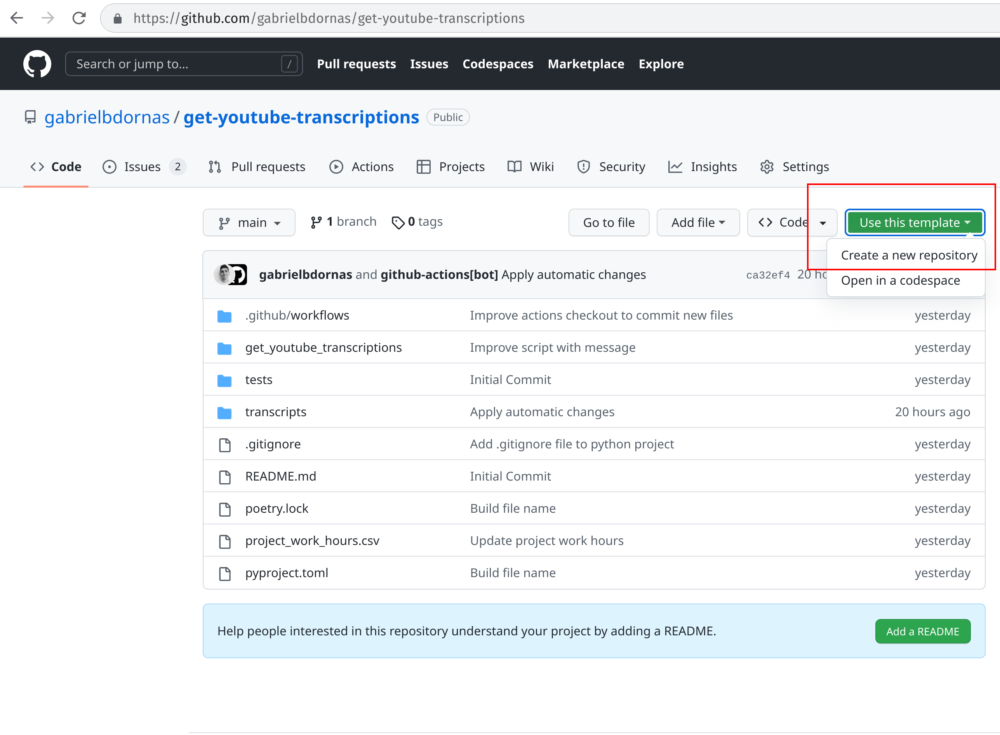
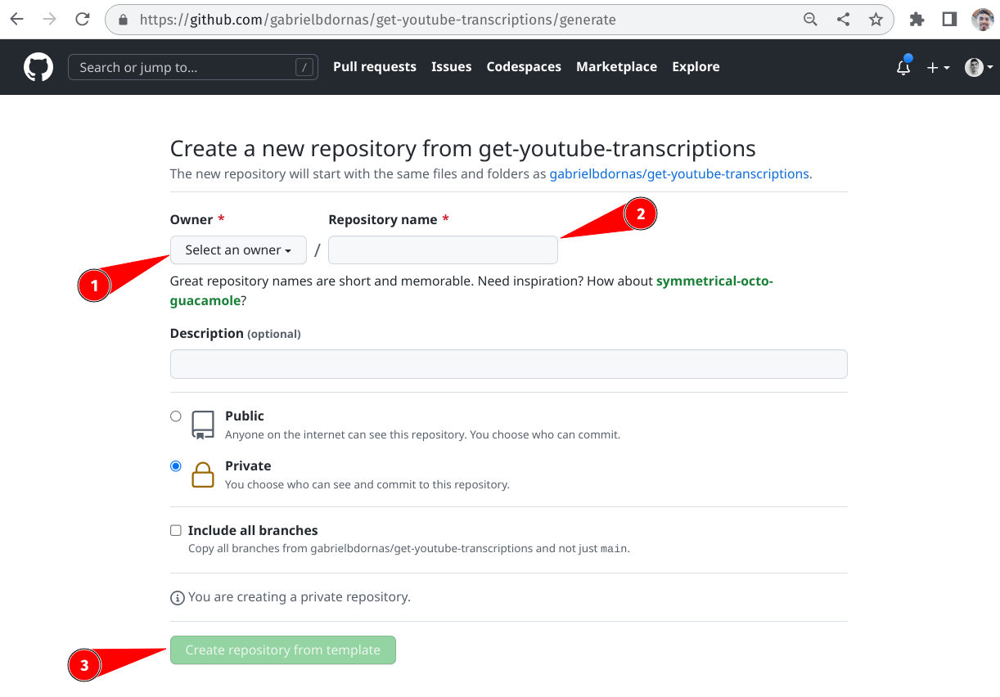
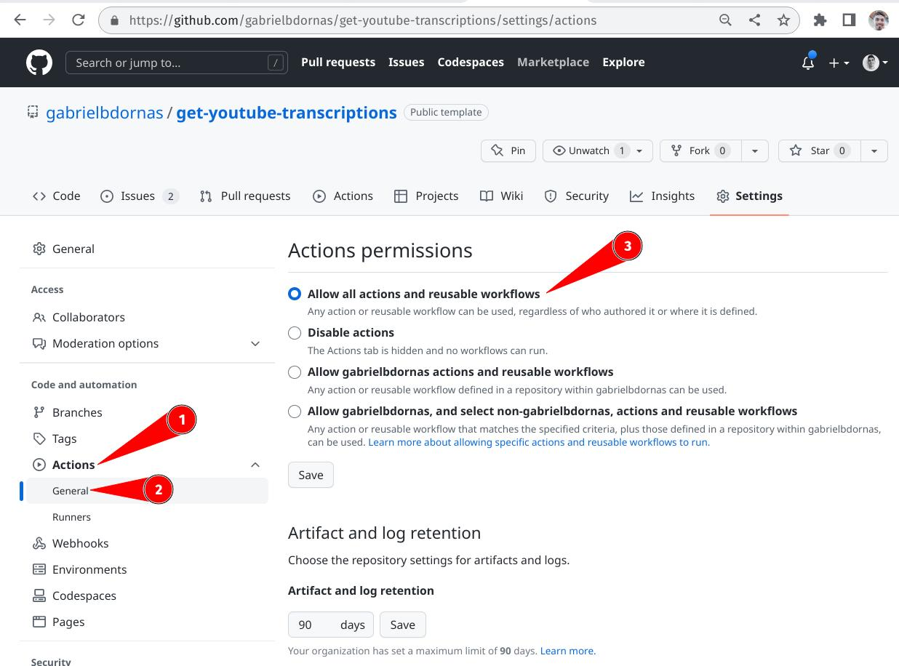
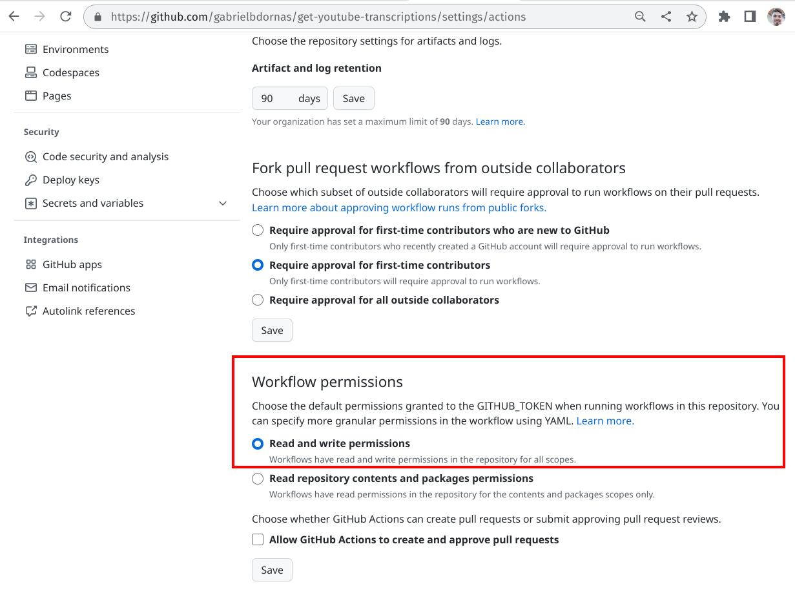
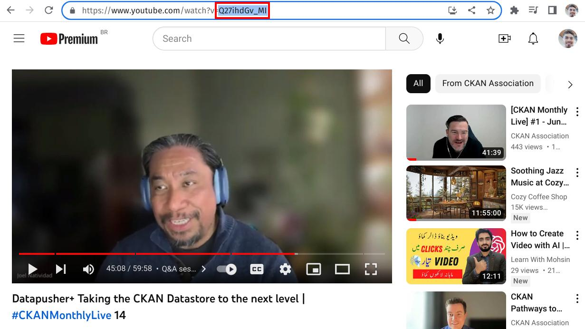
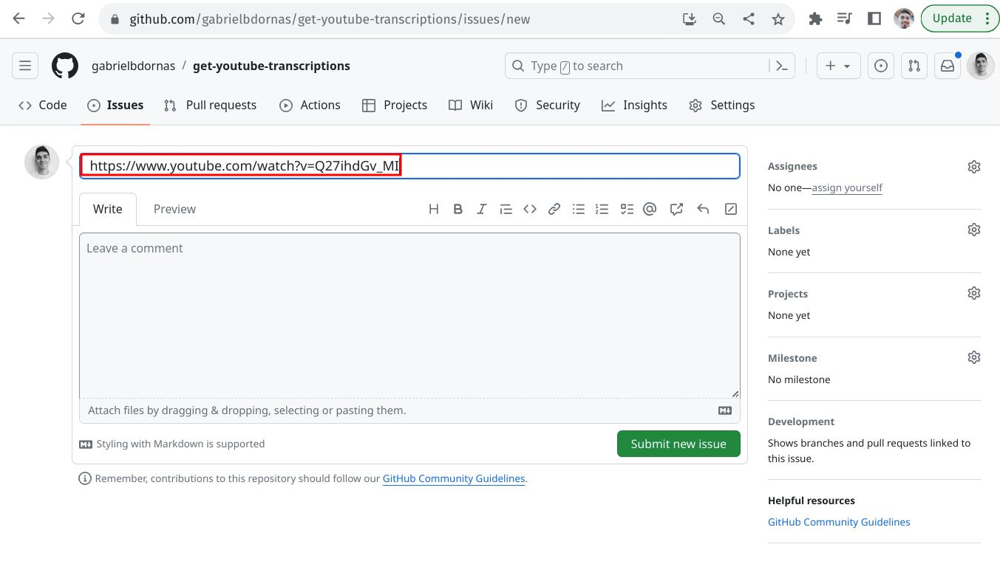
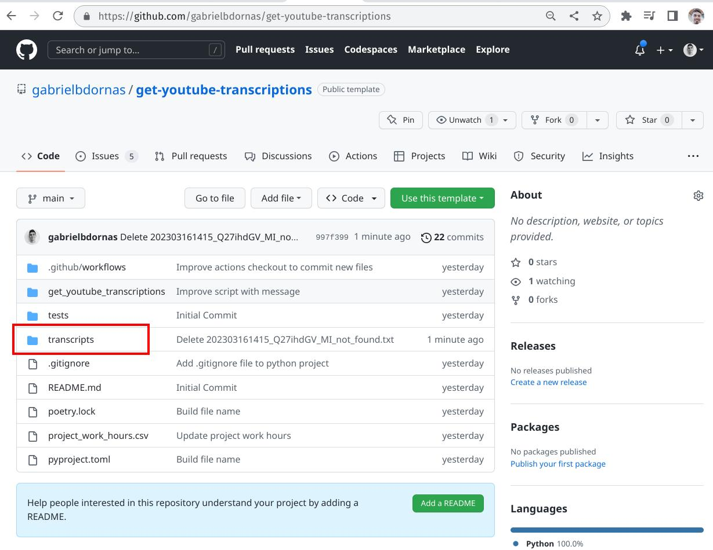
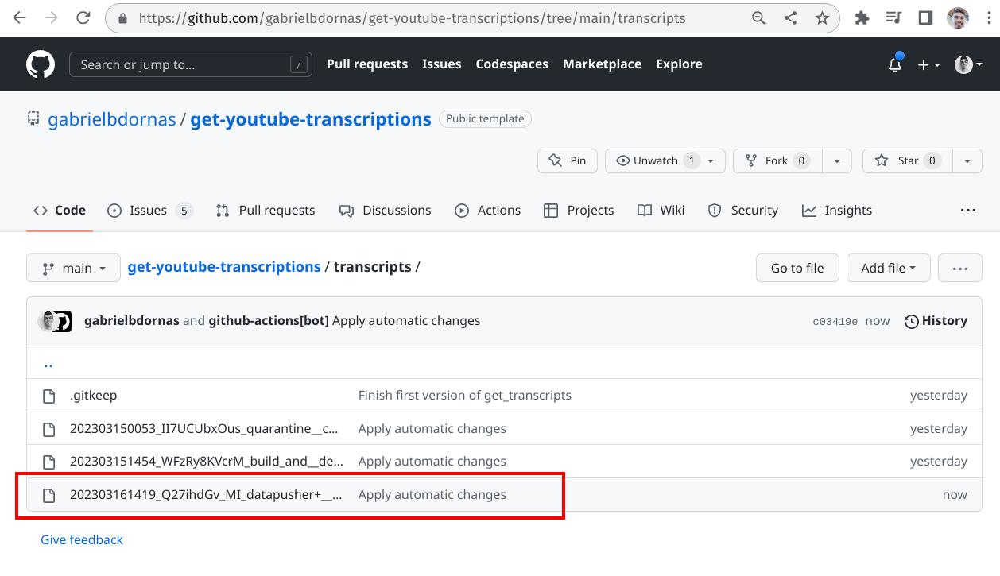
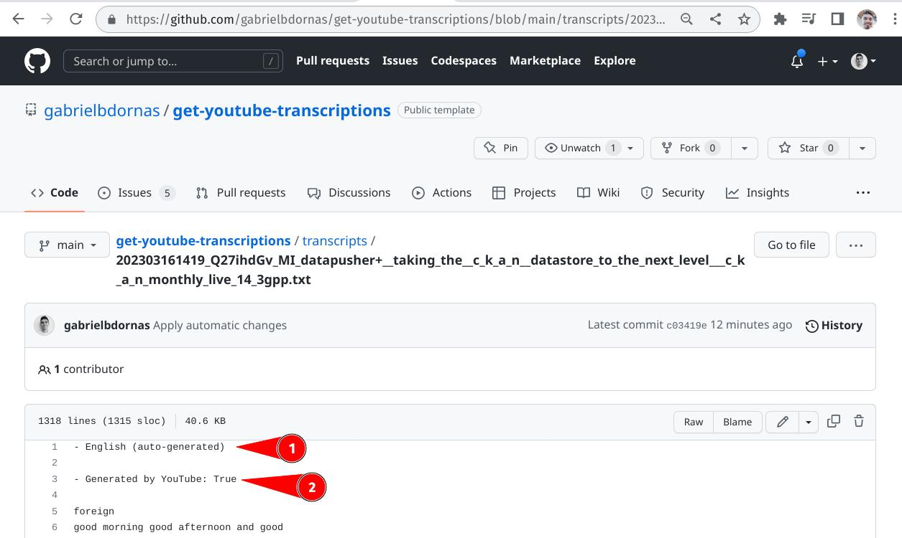

# Get YouTube Transcriptions :film_strip:

This repository aims to get YouTube video transcriptions through its id.
The repository infrastructure was thought to simplify project setup and usage.
The main idea here is to let you get your desired video transcription in a few clicks, in an easy "plug in and play" process.
In this regard, it doesn't need YouTube API tokens or complex configurations.
Instead of YouTube API, it uses [youtube-transcript-api Python library](https://pypi.org/project/youtube-transcript-api/).
Local repo clone or python environment configuration isn't necessary, although they could be done, being possible to use GitHub Actions to save the wanted YouTube video transcription into a `txt` file.

## Setup :open_book:

- Access the public [Get YouTube Transcription GitHub Repository](https://github.com/gabrielbdornas/get-youtube-transcriptions).

- Create a new repository from the repo template option (green button at the middle right of the page):

- Allow all GitHub actions to be used:

- Allow GitHub actions to read and write in your brand new repository (at the very end of the page shown above):

## Usage

- Get the wanted YouTube video link, with its id:

- Open an [issue](https://github.com/gabrielbdornas/get-youtube-transcriptions/issues/new) on your brand new repository, and use the wanted YouTube video link, with its id, as your new GitHub issue title:

- Find your transcription in the `transcripts` folder (it could take one minute[^1]):

## Expected Behavior

- The new `txt` file created in the `transcripts` folder will have the pattern name `yyyymmaahhmm_videoId_videoName.txt`

- If the passed video id doesn't exist the script will create a new `txt` file in the `transcripts` folder with the pattern name `yyyymmaahhmm_videoId_not_found.txt`

- The script will get manually created and auto-generated transcripts. By default the [youtube-transcript-api Python library](https://pypi.org/project/youtube-transcript-api/#:~:text=%27en%27%5D\)-,By,-default%20this%20module) picks manually created transcripts over automatically created ones. Both of them will be presented in the `txt` file if presented.

- Before the transcripts the `txt` file will present the language and if the transcription is manually created or auto-generated.

.

- Check out the completed `txt` file to find all transcriptions found.

## YouTube Demonstration

Click in the picture below to watch a short YouTube video explained all the repo functionalities and configuration.

## Contributions

Found something wrong or would like to send a suggestion.
Open an [Issue](https://github.com/gabrielbdornas/get-youtube-transcriptions/issues) for us.

[^1]: You could check the running process at the repos' `Actions` tab or at the end of the last repo commit.
